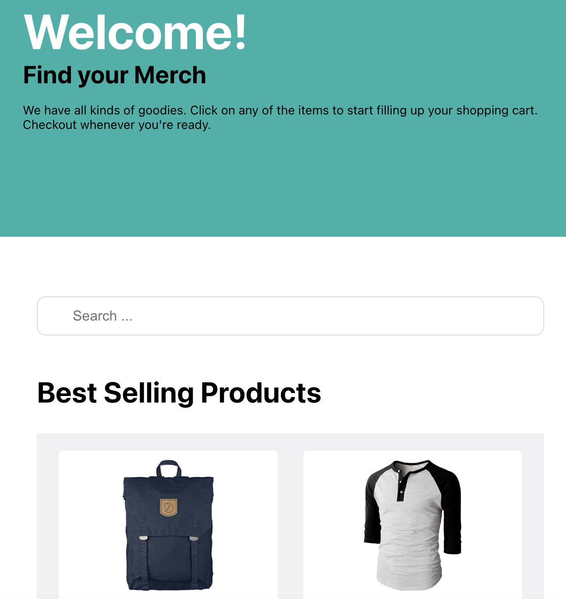
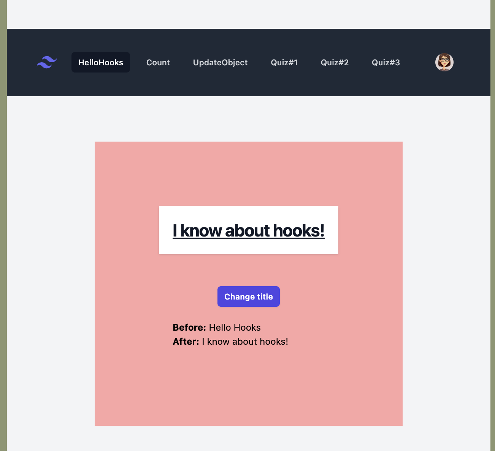

  

# Elena Reach

Over the last two years, I've dedicated significant time and effort to web development. 💻 Initially, I pursued self-study in HTML, CSS, and JavaScript. In September 2020, I enrolled in the <a href="https://rs.school/poland/?target=_blank">Rolling Scopes School</a> courses, and I successfully completed the program within six months, ranking among the top 300 students. 🎉 These courses not only deepened my theoretical knowledge of HTML, CSS, and JavaScript but also sharpened my practical skills through extensive hands-on exercises. I've since ventured into exploring the React library, along with its companions Redux, Hooks, and React Router.

Currently, I consider myself a junior front-end developer specializing in React. I'm actively seeking opportunities in Wrocław or remote positions. For potential job opportunities in Poland, it's worth noting that I hold a Karta Polaka. Please don't hesitate to get in touch if you have any questions or opportunities to discuss. 🙌

---

### Skills

 

---

### My projects

<i>At the moment I improve my React skills.</i> 💪

### React Apps

<table border="0">
  <tr>
    <th>Project description</th>
    <th width="35%">Preview</th>
  </tr>
  <tr>
    <td>
    
 Vaccine Scheduler

    
 <strong>Tools: React.js, Vite.js vanilla.js, Express.js</strong>
      

    
The Vaccine Scheduler is a user-friendly web app for COVID-19 vaccine appointments. Register, schedule, and confirm appointments easily. Features include login, registration, date selection, location preference, and secure login for access.

    
The index.html file is empty, all elements are generated via JavaScript. The application is displayed correctly both on desktop and on mobile devices.

      
You can find the code <a href="https://github.com/elenareach-developer/vaccsine">here</a>. Deploy is <a href="https://elenareach-developer.github.io/vaccsine/">here</a> or you can click on the image on the right.

    </td>
    <td>
      
    </td>
  </tr>
    <tr>
    <td>
    
Life Tracker

      

        <strong>Tools: React.js, Vite.js vanilla.js, CSS-Variables, JS-Classes, JS-Destructuring</strong>
      

"LifeTracker" - Your Health Companion

Stay active and healthy with our fitness devices. Register, log in, and explore the world of health and fitness. Contact us for inquiries.

      
The "LifeTracker" website is your destination for health and fitness. It offers various devices, encourages an active lifestyle, and features a trusted CodePath logo. Log in, register, and stay fit with advanced technology.

      
You can find the code <a href="https://github.com/elenareach-developer/lifetracker">here</a>. Deploy is <a href="https://elenareach-developer.github.io/lifetracker/">here</a> or you can click on the image on the right.

    </td>
    <td>
      
    </td>
    </tr>
    <tr>
      <td>
      
Portfolio Website

      

        <strong>Tools: vanilla JS, pure HTML/CSS</strong>
      

      
The <strong>Elena Reach - Software Engineer Portfolio</strong> showcases Elena Reach's professional journey, projects, and technical skills. It highlights her expertise in React, Vue, Node and Elastic Search

Discover Elena's software engineering expertise.

      
You can find the code <a href="https://github.com/elenareach-developer/portfolio-vite">here</a>. Deploy is <a href="https://elenareach-developer.github.io/portfolio-vite/">here</a> or you can click on the image below.

    </td>
    <td>
      
    </td>
  </tr>
   <tr>
      <td>
      
E-Commerce Store

      

        <strong>Tools: React,Veet, vanilla JS, pure HTML/CSS</strong>
      

     
The <strong>Online Store</strong> is your convenient e-commerce destination. Explore a wide range of products and enjoy exclusive offers. Shop from a diverse selection, easily manage your cart, and reach out to us for support or inquiries. Experience hassle-free online shopping at the Online Store!

      
You can find the code <a href="https://github.com/elenareach-developer/student-store">here</a>. Deploy is <a href="https://elenareach-developer.github.io/student-store/">here</a> or you can click on the image below.

    </td>
    <td>
      
    </td>
  </tr>
 <tr>
      <td>
      
React Learning Showcase

      

        <strong>Tools: UseState,UseHook, React Hooks, vanilla JS, pure HTML/CSS</strong>
      

   
Explore React development with this interactive showcase:

1. Layout, Navigation, Hooks, Counting, State Updates, Quizzes - Enhance your React skills.

Perfect for developers looking to level up their React game.

      
You can find the code <a href="https://github.com/elenareach-developer/useState-react">here</a>. Deploy is <a href="https://elenareach-developer.github.io/useState-react/">here</a> or you can click on the image below.

    </td>
    <td>
      
    </td>
  </tr>
 <tr>
      <td>
      
Dynamic Number Generator

      

        <strong>Tools: React, Veet.js, vanilla JS, pure HTML/CSS</strong>
      

     
The "Dynamic Number Generator" is a user-friendly web app for uploading PDF files, displaying dynamic numbers, and user control.

Upload PDFs, see real-time numbers, and manage auto-generation with Start and Stop buttons. It's a practical tool for various tasks.

      
You can find the code <a href="https://github.com/elenareach-developer/randomButtons---react">here</a>. Deploy is <a href="https://elenareach-developer.github.io/randomButtons---react/">here</a> or you can click on the image below.

    </td>
    <td>
      
    </td>
  </tr>
</table>

### Web-site`s template

<table border="0">
  <tr>
    <th>Project description</th>
    <th width="35%">Preview</th>
  </tr>
  <tr>
    <td>
    
Helsinkicitybike

    
 <strong>Tools: vanilla JavaScript, React.Js pure HTML/CSS, Bootsrap</strong>
      

    
The "Data Dashboard and Reporting" website offers easy navigation and a range of features for accessing and managing data.

Explore order, customer, and integration sections, view current month and last quarter data, and dive into year-end sale statistics.

    
You can find the code <a href="https://github.com/elenareach-developer/Helsinkicitybike">here</a>. Deploy is <a href="https://elenareach-developer.github.io/Helsinkicitybike/">here</a> or you can click on the image on the right.

    </td>
    <td>
      
    </td>
  </tr>
  <tr>
    <td>
    
Relvise

    
 <strong>Tools: vanilla JavaScript, pure HTML/CSS CSS-Flexbox, CSS-Variables</strong>
      

    
The "Samantha He - Software Developer Portfolio" is a comprehensive online showcase that provides insight into Samantha He's professional journey as a software developer.

Explore her diverse experiences and notable work in mobile app design, web design, and product design. Connect with Samantha to learn more about her contributions to the tech world.

    
You can find the code <a href="https://github.com/elenareach/site-week1-lab1-personal-website-exemplar">here</a>. Deploy is <a href="https://elenareach.github.io/site-week1-lab1-personal-website-exemplar/index.html">here</a> or you can click on the image on the right.

    </td>
    <td>
      
    </td>
  </tr>
   </table>

---

<!-- ### My publication -->
<!-- 
There is <a href="https://elenareach.medium.com/%D0%B8%D1%82%D0%BE%D0%B3%D0%BE%D0%B2%D1%8B%D0%B9-%D0%BF%D1%80%D0%BE%D0%B5%D0%BA%D1%82-%D1%81%D1%82%D1%83%D0%B4%D0%B5%D0%BD%D1%82%D0%BE%D0%B2-rolling-scopes-school-%D0%BA%D0%BB%D0%BE%D0%BD-monefy-4402a007b6aa"> an article on Medium </a>about our team project Clone-Monefy
 -->

### My GitHub Stats

 
 <b>click here</b> 

&nbsp;

 

 

 <!-- 

 
 <b>My programming Stats</b> 

 <!--START_SECTION:waka-->

<!--END_SECTION:waka-->
 <!-- 
 -->

---

### Contact me 📫

